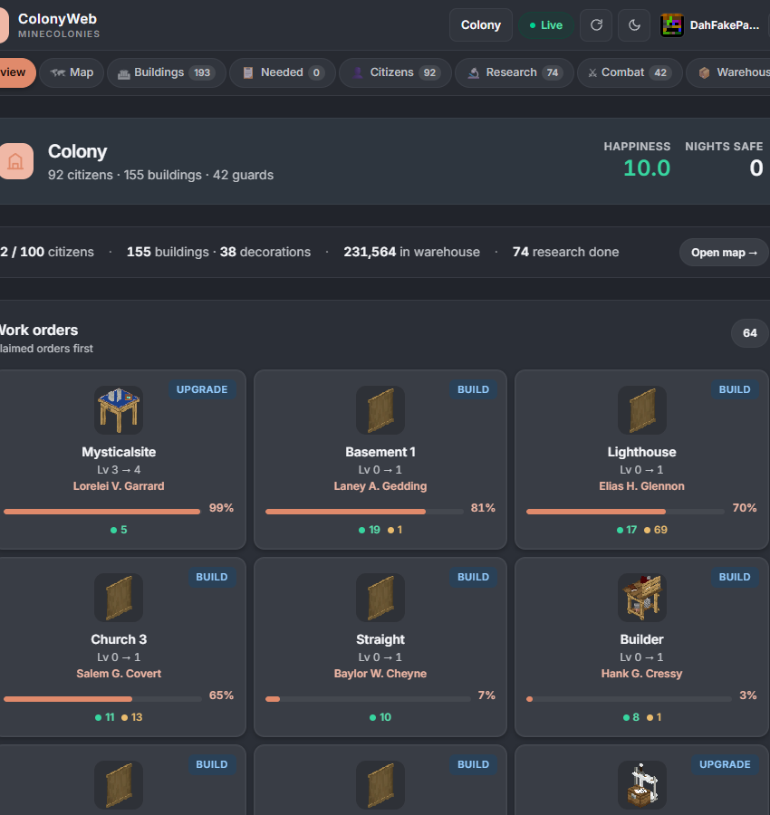
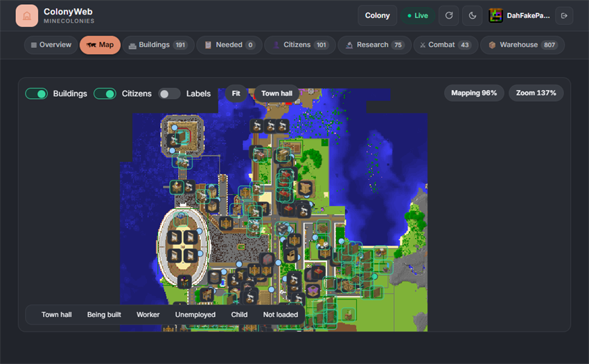
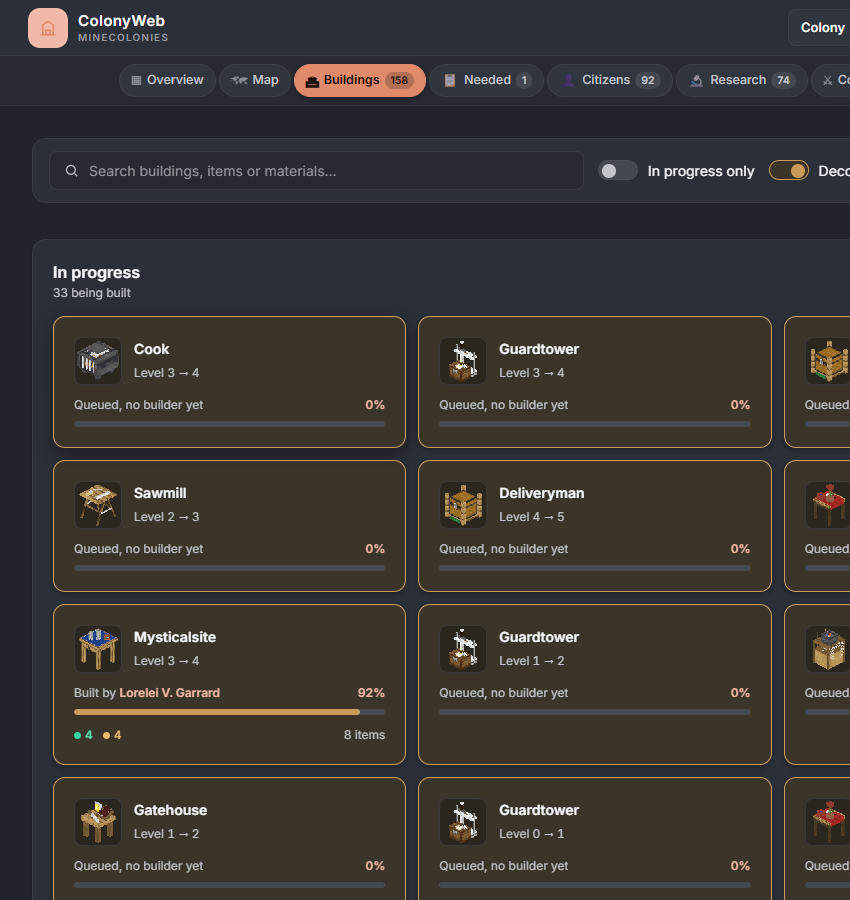
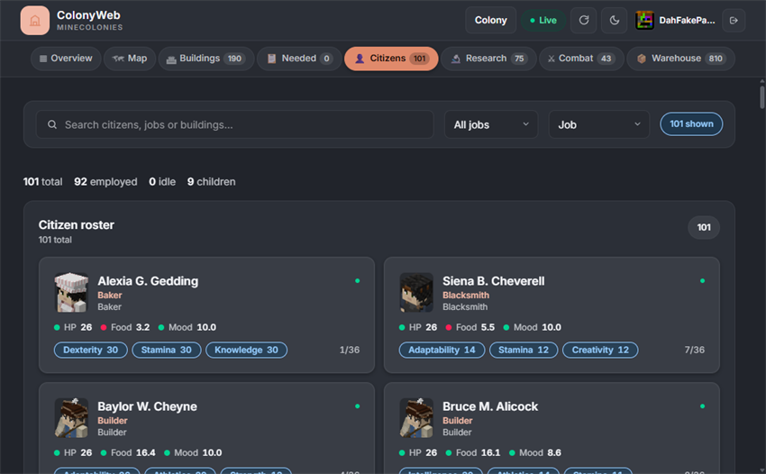
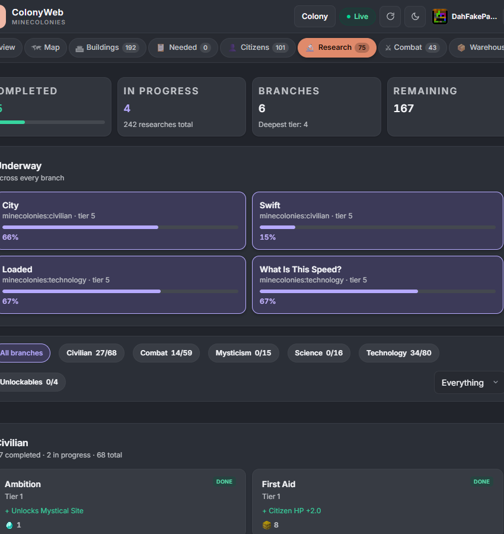
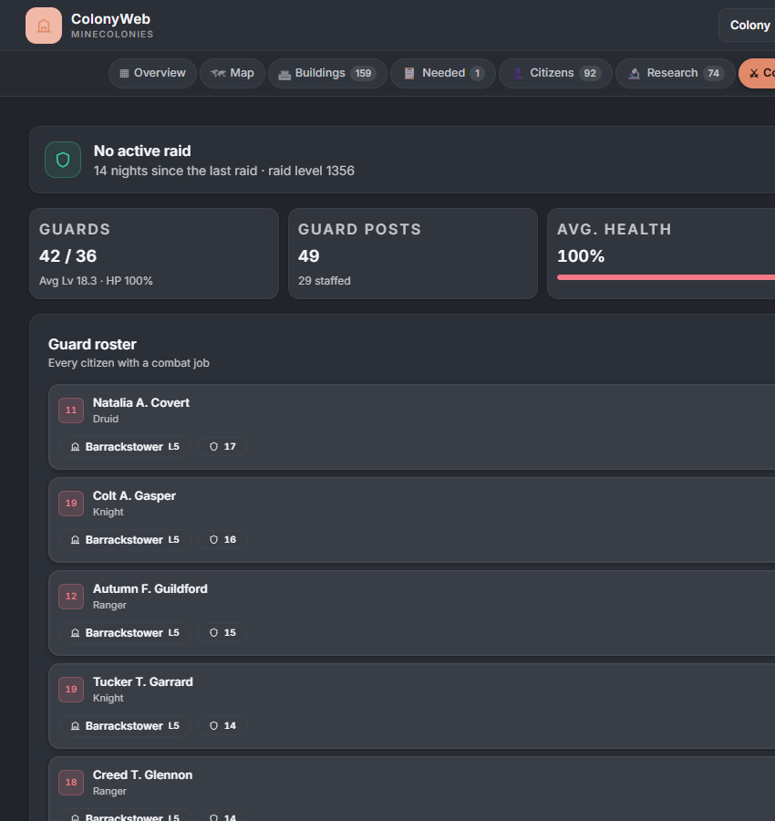
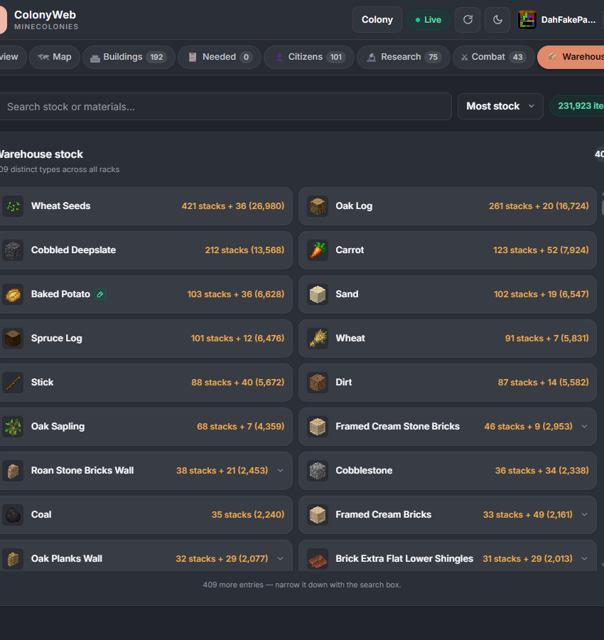

# ColonyWeb

A **server-side-only** Minecraft mod for **1.20.1 (Forge)** and **1.21.1 (NeoForge)** that adds a live web dashboard for [MineColonies](https://www.curseforge.com/minecraft/mc-mods/minecolonies) colonies. Open it in any browser to see builder progress, resource needs, citizens, research, defence stats, and warehouse stock — all with live updates via server-sent events.

Players sign in with a pairing code from `/colonyweb sync` and only see colonies they belong to. The mod does **not** need to be installed on the client.

---

## Features

Seven tabs, every one of them live — colony data streams in over SSE, so nothing here needs a manual refresh.

<!-- Screenshots live in docs/screenshots/. Every tab below already has its image line written
     out and commented; add the matching PNG and uncomment the line to make it appear.
     Keep them 850px wide or narrower — CurseForge reuses this page and clips anything wider.
     docs/screenshots/README.md has the rest of the capture notes. -->

### Overview

Stat tiles for citizens, happiness, buildings, defence, warehouse and research, the builder roster, and every work order sorted by activity so whatever is moving sits at the top.

<!--  -->

### Map

A pannable, zoomable top-down render of the colony, one pixel per block, with building pins and live citizen dots. Auto-fit and centre-on-town-hall controls, and toggles for buildings, citizens and labels.

<!--  -->

### Buildings

A card grid with search and sort (status, name, progress, level) plus in-progress and decoration filters. Click any card for a detail modal listing the resources that build still needs.

<!--  -->

### Citizens

The full roster with a job filter and search. Each citizen opens into a skill breakdown, health and happiness meters, and their inventory and equipment.

<!--  -->

### Research

University branches drawn as progress bars, with state pills and item-cost icons for whatever each unlock wants.

<!--  -->

### Combat

Guard post staffing at a glance — ok, deliver or missing — with guard health and a raid banner counting the nights since the last attack.

<!--  -->

### Warehouse

Aggregated colony stock across every rack, searchable and sortable by count or alphabetically.

<!--  -->

---

## Dependencies

All three are required — install them alongside ColonyWeb.

| Mod | Notes |
|---|---|
| [KotlinForForge](https://www.curseforge.com/minecraft/mc-mods/kotlin-for-forge) | Provides the Kotlin runtime the mod is compiled against. Use the Forge variant for 1.20.1 and the NeoForge variant for 1.21.1. |
| [MineColonies](https://www.curseforge.com/minecraft/mc-mods/minecolonies) | The source of every colony the dashboard renders. |
| [Domum Ornamentum](https://www.curseforge.com/minecraft/mc-mods/domum-ornamentum) | Dynamically textured decorative blocks used by MineColonies builds. The dashboard shows their icons. |

---

## Installation

1. Drop the ColonyWeb jar **and its dependencies** into your server's `mods/` folder.
2. Start the server — the config file `config/colonyweb-common.toml` is generated automatically.
3. Open `http://your-server-ip:8723` in any browser.
4. Run `/colonyweb sync` in-game and enter the pairing code on the web page.

---

## Configuration

File: `config/colonyweb-common.toml`

| Option | Default | Description |
|---|---|---|
| `httpPort` | `8723` | HTTP server port |
| `bindAddress` | `0.0.0.0` | Bind address (set to `127.0.0.1` with a reverse proxy for production) |
| `publicHost` | *(blank)* | Host name used in the link `/colonyweb` prints. Blank means the server's detected address |
| `refreshIntervalSeconds` | `3` | How often colony data is re-scanned and pushed over SSE |
| `autoDownloadVanillaAssets` | `true` | Download the matching vanilla client jar on first start so vanilla item/block icons can be shown |
| `mapEnabled` | `true` | Show the colony map tab 
| `mapRadius` | `256` | How far from the colony centre the map reaches, in blocks |
| `authEnabled` | `true` | Require pairing-code authentication. Turning this off makes the dashboard public to anyone who can reach the port |
| `sessionDays` | `30` | How long a browser stays signed in after entering a pairing code |
| `loginCodeMinutes` | `10` | How long a pairing code from `/colonyweb sync` stays valid |

---

## In-Game Commands

| Command | Permission | Description |
|---|---|---|
| `/colonyweb` | Any | Print the dashboard link |
| `/colonyweb sync` | Any | Generate a one-shot pairing code for yourself |
| `/colonyweb port` | Any | Show the port the dashboard is listening on |
| `/colonyweb sync <player>` | OP | Issue a pairing code for someone else |
| `/colonyweb access grant <player> <colony>` | OP | Grant a player access to one colony by ID |
| `/colonyweb access revoke <player> <colony>` | OP | Take that grant away |
| `/colonyweb access list <player>` | OP | Show which colonies a player can see |
| `/colonyweb logout <player>` | OP | Invalidate all of a player's web sessions |
| `/colonyweb status` | OP | Show service, auth and session stats |

## Signing In

1. Run `/colonyweb sync` in-game. A short code appears in chat (e.g. `3B7X-K2L9`).
2. Open your browser to the server's dashboard URL.
3. Type the code into the pairing screen. Codes are case-insensitive.

The code is single-use and expires after 10 minutes by default (`loginCodeMinutes`). Once accepted, the browser stays signed in for `sessionDays` — 30 days by default.

## Troubleshooting

| Symptom | Likely cause |
|---|---|
| Page won't load / connection refused | Server port not reachable — check firewall and port forwarding |
| "No colonies to show" | Player hasn't joined a MineColonies colony yet, or the pairing code was for a different player |
| Pairing code not accepted | Code expired (`loginCodeMinutes`, 10 min by default) or already used — run `/colonyweb sync` again |
| Dashboard loads but all tabs are empty | MineColonies not installed or not loaded on the server |
| Images / textures missing | First load downloads vanilla assets — may take a minute on slow connections |

See the server log (`latest.log`) for lines prefixed with `[ColonyWeb]`.

## License

GNU General Public License v3.0 — see [LICENSE](LICENSE).
